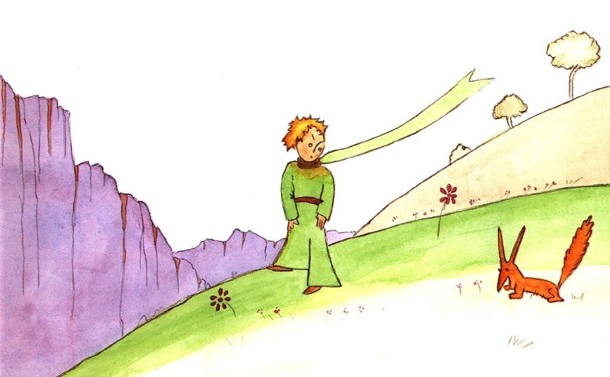
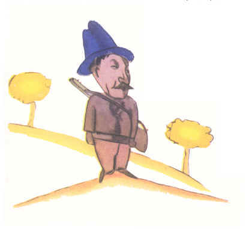
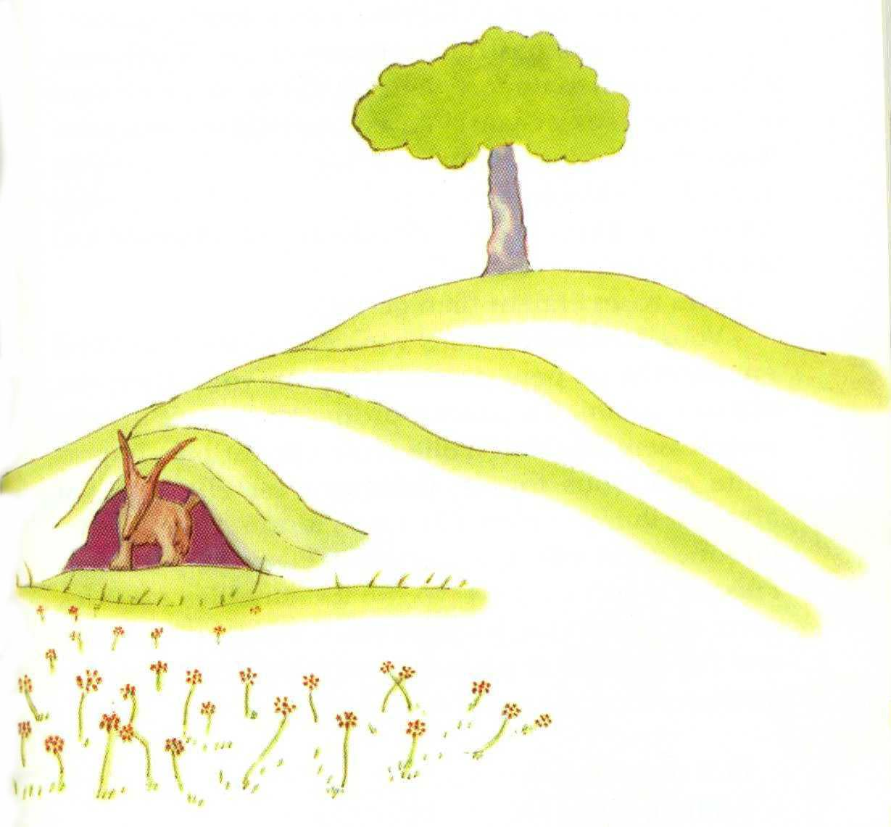

C'est alors qu'apparut le renard:

\-Bonjour, dit le renard.

\-Bonjour, répondit poliment le petit prince, qui se retourna mais ne vit rien.

\-Je suis là, dit la voix, sous le pommier.

\-Qui es-tu ? dit le petit prince. Tu es bien joli...

\-Je suis un renard, dit le renard.

\-Viens jouer avec moi, lui proposa le petit prince. Je suis tellement triste...

\-Je ne puis pas jouer avec toi, dit le renard. Je ne suis pas apprivoisé.

\-Ah! pardon, fit le petit prince.

Mais, après réflexion, il ajouta:

\-Qu'est-ce que signifie "apprivoiser" ?

\-Tu n'es pas d'ici, dit le renard, que cherches-tu ?

\-Je cherche les hommes, dit le petit prince. Qu'est-ce que signifie "apprivoiser" ?

\-Les hommes, dit le renard, ils ont des fusils et ils chassent. C'est bien gênant ! Ils élèvent aussi des poules. C'est leur seul intérêt. Tu cherches des poules ?

\-Non, dit le petit prince. Je cherche des amis. Qu'est-ce que signifie "apprivoiser" ?

\-C'est une chose trop oubliée, dit le renard. Ça signifie "créer des liens..."

\-Créer des liens ?

\-Bien sûr, dit le renard. Tu n'es encore pour moi qu'un petit garçon tout semblable à cent mille petits garçons. Et je n'ai pas besoin de toi. Et tu n'as pas besoin de moi non plus. Je ne suis pour toi qu'un renard semblable à cent mille renards. Mais, si tu m'apprivoises, nous aurons besoin l'un de l'autre. Tu seras pour moi unique au monde. Je serai pour toi unique au monde...

\-Je commence à comprendre, dit le petit prince. Il y a une fleur... je crois qu'elle m'a apprivoisé...

\-C'est possible, dit le renard. On voit sur la Terre toutes sortes de choses...

\-Oh! ce n'est pas sur la Terre, dit le petit prince.

Le renard parut très intrigué :

\-Sur une autre planète ?

\-Oui.

\-Il y a des chasseurs, sur cette planète-là ?

\-Non.

\-Ça, c'est intéressant ! Et des poules ?

\-Non.

\-Rien n'est parfait, soupira le renard.

Mais le renard revint à son idée:

\-Ma vie est monotone. Je chasse les poules, les hommes me chassent. Toutes les poules se ressemblent, et tous les hommes se ressemblent. Je m'ennuie donc un peu. Mais, si tu m'apprivoises, ma vie sera comme ensoleillée. Je connaîtrai un bruit de pas qui sera différent de tous les autres. Les autres pas me font rentrer sous terre. Le tien m'appellera hors du terrier, comme une musique. Et puis regarde ! Tu vois, là-bas, les champs de blé ? Je ne mange pas de pain. Le blé pour moi est inutile. Les champs de blé ne me rappellent rien. Et ça, c'est triste ! Mais tu as des cheveux couleur d'or. Alors ce sera merveilleux quand tu m'auras apprivoisé ! Le blé, qui est doré, me fera souvenir de toi. Et j'aimerai le bruit du vent dans le blé...

Le renard se tut et regarda longtemps le petit prince:

\-S'il te plaît... apprivoise-moi ! dit-il.

\-Je veux bien, répondit le petit prince, mais je n'ai pas beaucoup de temps. J'ai des amis à découvrir et beaucoup de choses à connaître.

\-On ne connaît que les choses que l'on apprivoise, dit le renard. Les hommes n'ont plus le temps de rien connaître. Ils achètent des choses toutes faites chez les marchands. Mais comme il n'existe point de marchands d'amis, les hommes n'ont plus d'amis. Si tu veux un ami, apprivoise-moi !

\-Que faut-il faire? dit le petit prince.

\-Il faut être très patient, répondit le renard. Tu t'assoiras d'abord un peu loin de moi, comme ça, dans l'herbe. Je te regarderai du coin de l'œil et tu ne diras rien. Le langage est source de malentendus. Mais, chaque jour, tu pourras t'asseoir un peu plus près...

Le lendemain revint le petit prince.

\-Il eût mieux valu revenir à la même heure, dit le renard. Si tu viens, par exemple, à quatre heures de l'après-midi, dès trois heures je commencerai d'être heureux. Plus l'heure avancera, plus je me sentirai heureux. A quatre heures, déjà, je m'agiterai et m'inquiéterai; je découvrirai le prix du bonheur ! Mais si tu viens n'importe quand, je ne saurai jamais à quelle heure m'habiller le cœur... Il faut des rites.

\-Qu'est-ce qu'un rite ? dit le petit prince.

\-C'est aussi quelque chose de trop oublié, dit le renard. C'est ce qui fait qu'un jour est différent des autres jours, une heure, des autres heures. Il y a un rite, par exemple, chez mes chasseurs. Ils dansent le jeudi avec les filles du village. Alors le jeudi est jour merveilleux ! Je vais me promener jusqu'à la vigne. Si les chasseurs dansaient n'importe quand, les jours se ressembleraient tous, et je n'aurais point de vacances.

Ainsi le petit prince apprivoisa le renard. Et quand l'heure du départ fut proche:

\-Ah! dit le renard... Je pleurerai.

\-C'est ta faute, dit le petit prince, je ne te souhaitais point de mal, mais tu as voulu que je t'apprivoise...

\-Bien sûr, dit le renard.

\-Mais tu vas pleurer ! dit le petit prince.

\-Bien sûr, dit le renard.

\-Alors tu n'y gagnes rien !

\-J'y gagne, dit le renard, à cause de la couleur du blé.

Puis il ajouta:

\-Va revoir les roses. Tu comprendras que la tienne est unique au monde. Tu reviendras me dire adieu, et je te ferai cadeau d'un secret.

Le petit prince s'en fut revoir les roses:

\-Vous n'êtes pas du tout semblables à ma rose, vous n'êtes rien encore, leur dit-il. Personne ne vous a apprivoisé et vous n'avez apprivoisé personne. Vous êtes comme était mon renard. Ce n'était qu'un renard semblable à cent mille autres. Mais j'en ai fait mon ami, et il est maintenant unique au monde.

Et les roses étaient bien gênées.

\-Vous êtes belles, mais vous êtes vides, leur dit-il encore. On ne peut pas mourir pour vous. Bien sûr, ma rose à moi, un passant ordinaire croirait qu'elle vous ressemble. Mais à elle seule elle est plus importante que vous toutes, puisque c'est elle que j'ai arrosée. Puisque c'est elle que j'ai mise sous globe. Puisque c'est elle que j'ai abritée par le paravent. Puisque c'est elle dont j'ai tué les chenilles (sauf les deux ou trois pour les papillons). Puisque c'est elle que j'ai écoutée se plaindre, ou se vanter, ou même quelquefois se taire. Puisque c'est ma rose.

Et il revint vers le renard:

\-Adieu, dit-il...

\-Adieu, dit le renard. Voici mon secret. Il est très simple: on ne voit bien qu'avec le cœur. L'essentiel est invisible pour les yeux.

\-L'essentiel est invisible pour les yeux, répéta le petit prince, afin de se souvenir.

\-C'est le temps que tu as perdu pour ta rose qui fait ta rose si importante.

\-C'est le temps que j'ai perdu pour ma rose... fit le petit prince, afin de se souvenir.

\-Les hommes ont oublié cette vérité, dit le renard. Mais tu ne dois pas l'oublier. Tu deviens responsable pour toujours de ce que tu as apprivoisé. Tu es responsable de ta rose...

\-Je suis responsable de ma rose... répéta le petit prince, afin de se souvenir.
